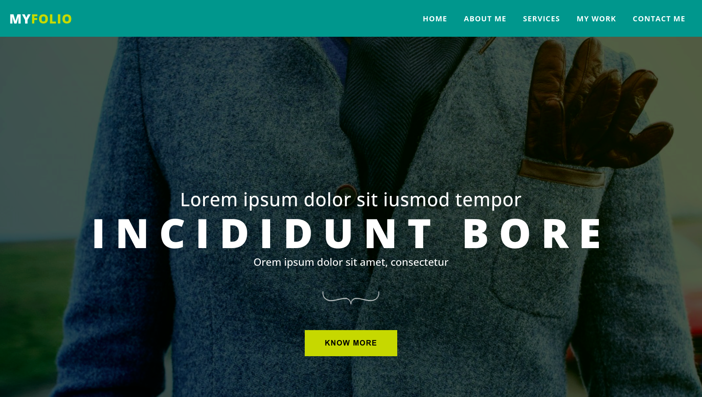

<h1 align="center">myfolio</h1>

## Table of Contents

- [Table of Contents](#table-of-contents)
- [Overview](#overview)
  - [Built With](#built-with)
- [How To Use](#how-to-use)
- [Clone this repository](#clone-this-repository)
- [Acknowledgements](#acknowledgements)
- [Contact](#contact)

## Overview




### Built With

- [HTML](#built-with)
- [CSS](#built-with)
- [JavaScript](#built-with)

## How To Use

To clone and run this application, you'll need [Git](https://git-scm.com) installed on your computer. From your command line:
## Clone this repository
```bash
git clone https://github.com/saadman-galib/myfolio.git
```


## Acknowledgements

- Steps to replicate a design with only HTML and CSS


## Contact

- GitHub [@saadman-galib](https://www.github.com/saadman-galib)
- Twitter [@GalibSaadman](https://www.twitter.com/GalibSaadman)